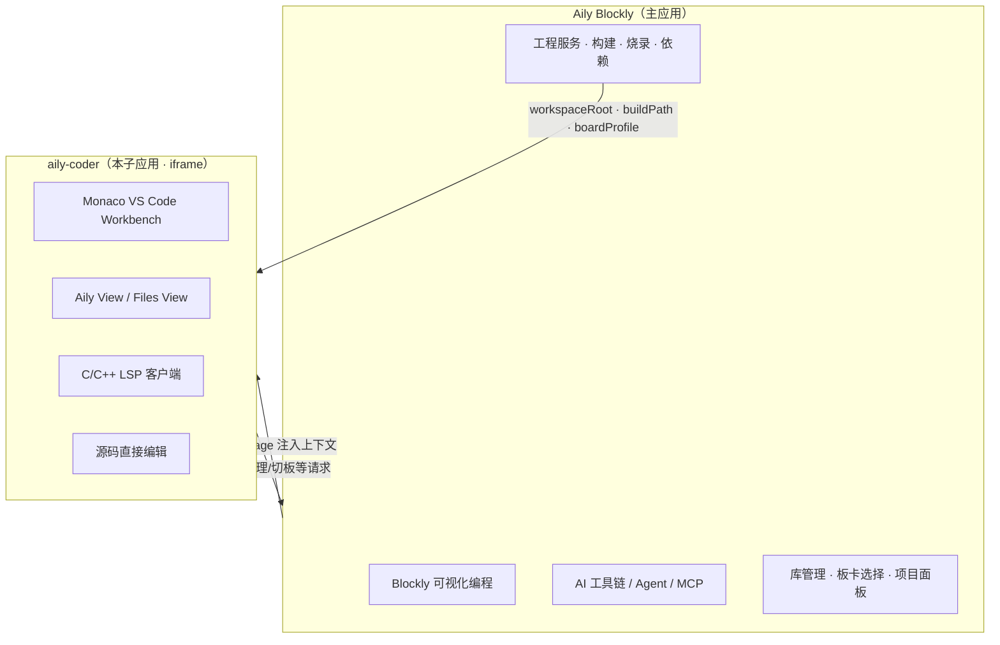

# aily-coder

**Aily Blockly 内嵌代码编辑器子应用** — 基于 Monaco + VS Code API 的 Web 工作台，用于在宿主中直接打开、浏览与编辑 Aily Code 工程源码。

---

## 重要说明：项目定位

> **请先阅读本节，再评估本仓库的职责边界。**

| 维度 | Aily Blockly（主应用） | aily-coder（本仓库） |
|------|------------------------|----------------------|
| 角色 | 主产品：Blockly 可视化编程、工程管理、构建/烧录、库与板卡管理 | **子应用**：内嵌 iframe，承载「代码侧」可视化编辑 |
| AI 工具链 | **核心所在**：对话、Agent、MCP、项目级 AI 工作流等 | **不承担**主 AI 能力；仅可选提供编辑器内行间补全等轻量体验 |
| 用户心智 | 创作入口、设备与依赖、完整闭环 | 打开 `src/main.cpp`、`project.aci` 等文件做**直接编辑** |
| 数据与状态 | 项目服务、构建路径、板卡/库 UI、全局 `appdata` | 通过 `postMessage` / `BroadcastChannel` 接收宿主上下文，读写工作区文件 |

**结论：**

1. **aily-coder 不是独立 IDE，也不是 AI 产品本体。**
2. **核心 AI 工具链、Blockly 逻辑与工程闭环均在 Aily Blockly 主仓库（Angular + Electron 宿主）中实现。**
3. **本仓库的职责是：在宿主内提供 VS Code 风格的代码编辑 surface**，包括逻辑工程树（Aily View）、物理文件树、C/C++ 语言服务桥接，以及与宿主对齐的嵌入布局与原生文件系统桥接。

若你需要扩展 Agent、聊天面板、MCP 或 Blockly 块级 AI，请到 **Aily Blockly** 主仓库；若仅需调整内嵌编辑体验或 Aily View 展示，则在本仓库修改。

---

## 架构关系



嵌入模式下，宿主（如 Angular `code-editor-pro`）通过 iframe 加载本应用，并注入：

- 工作区根路径、构建产物路径
- 板卡 / framework 概要、Platform Packages
- 原生文件系统 Reveal、剪贴板、布局刷新等能力

相关契约见 `src/hostEmbedContext.ts`、`src/parentBackedNativeFs.ts`。

---

## 本仓库提供什么

- **内嵌代码工作台**：基于 `@codingame/monaco-vscode-*` 的暗色 IDE 风格 UI，与 Aily Blockly 视觉规范对齐。
- **Aily View**：按工程语义展示逻辑树（`Start Here`、`Project Files`、`Dependencies`、`Board & Platform` 等），详见 `docs/aily-code工程视图与信息架构设计.md`。
- **源码编辑**：C/C++、JavaScript/TypeScript 等语言扩展；Monaco 编辑器与基础语言特性。
- **语言服务桥接**：`monacoStdioLspClient` + `server/lspWsProxy.ts`，对接 clangd 等 LSP（需配合影子工作区 / `compile_commands`）。
- **宿主协同**：嵌入布局同步、侧栏顶栏、命令面板裁剪、OS 级 Reveal 转发等。

## 本仓库不提供什么

以下能力由 **Aily Blockly 主应用** 或其它后端服务负责，**不在本仓库实现或维护**：

- Blockly 积木编辑与代码生成主流程
- 项目级 AI 对话、Agent、工具调用编排
- `project.aci` / 依赖解析 / xpm / 完整构建·烧录·监视器闭环（宿主调度，本子应用仅展示与编辑相关 UI）
- 独立的桌面安装包或脱离宿主的全功能 IDE 发行

---

## 技术栈

- **构建**：Vite 8、TypeScript 5.9
- **编辑器内核**：Monaco Editor + Codingame Monaco VS Code API（Workbench / Extension Host）
- **嵌入通信**：`postMessage`、`BroadcastChannel`、可选 `parentBackedNativeFs` 桥接
- **语言服务**：`monaco-languageclient` + WebSocket LSP 代理（`npm run lsp-proxy`）

---

## 目录概览

```text
aily-coder/
├── src/
│   ├── entry.ts              # 入口（sandbox / loader）
│   ├── setup.common.ts       # Workbench 与服务注入、嵌入 FS
│   ├── hostEmbedContext.ts   # 宿主上下文契约
│   ├── features/
│   │   ├── ailyViewExplorer.ts      # Aily View 逻辑工程树
│   │   ├── monacoStdioLspClient.ts  # LSP 客户端
│   │   └── aiInlineCompletion.ts    # 可选行间补全（非主 AI 链）
│   └── bridge/               # compile_commands 等桥接（进行中）
├── server/
│   └── lspWsProxy.ts         # LSP WebSocket 代理
└── docs/                     # Aily Code 工程模型与 MVP 设计文档
```

设计文档（工程目录、视图 IA、MVP 清单）位于 `docs/`，描述的是 **Aily Code 产品模型**；实现上由主应用与子应用分工完成，请勿将文档中的「全栈能力」默认等同于本仓库范围。

---

## 本地开发

### 环境要求

- Node.js 22+
- npm

### 安装与启动

```bash
npm install
npm start
```

浏览器访问开发服务器（默认由 Vite 提供）。独立打开时可通过 URL 参数选择文件夹或 IndexedDB 等模式，详见 `src/setup.common.ts`。

### 常用脚本

| 命令 | 说明 |
|------|------|
| `npm start` | 开发服务器 |
| `npm run build` | 类型检查 + 生产构建 |
| `npm run lint` | ESLint |
| `npm run lsp-proxy` | 启动 LSP WebSocket 代理（配合 clangd） |

### 可选：行间 AI 补全

复制 `.env.example` 为 `.env`，配置 `VITE_AI_INLINE_*`。默认 **FIM 模式**（LM Studio 0.4+ 走 `POST /api/v1/chat`；旧 OpenAI 兼容为 `/v1/completions`）；此为**编辑器内辅助能力**，与 Aily Blockly 主 AI 工具链无关；未配置 URL 时使用本地 mock。

---

## 在 Aily Blockly 中嵌入

生产环境中，本应用作为静态资源由 **Aily Blockly** 构建产物引用，以 iframe 形式嵌入代码编辑区域。宿主需：

1. 传入工作区路径（如 `?folder=`）并建立 `parentBackedNativeFs`（Electron 场景）。
2. 通过 `aily-coder-host-context` 通道推送 `HostEmbedContextV1`。
3. 监听 `aily-coder-open-library-manager`、`aily-coder-open-board-selector` 等子应用请求，复用主应用已有 UI。

具体集成代码在 **Aily Blockly** 仓库的 `code-editor-pro` 等模块中维护。

---

## 相关文档

| 文档 | 说明 |
|------|------|
| [docs/aily-code工程视图与信息架构设计.md](docs/aily-code工程视图与信息架构设计.md) | Aily View 节点模型与交互规格 |
| [docs/aily-code最终目录与生命周期设计.md](docs/aily-code最终目录与生命周期设计.md) | 工程目录与生命周期定稿 |
| [docs/aily-code-MVP实施清单.md](docs/aily-code-MVP实施清单.md) | 跨产品/前端/核心/构建链 MVP 任务 |

---

## 许可证

见 [LICENSE](LICENSE)。
