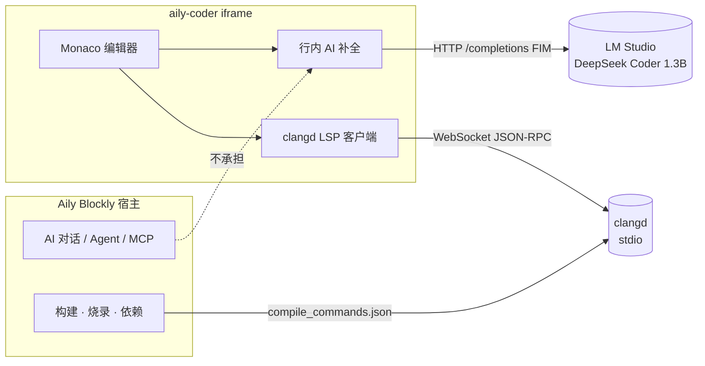
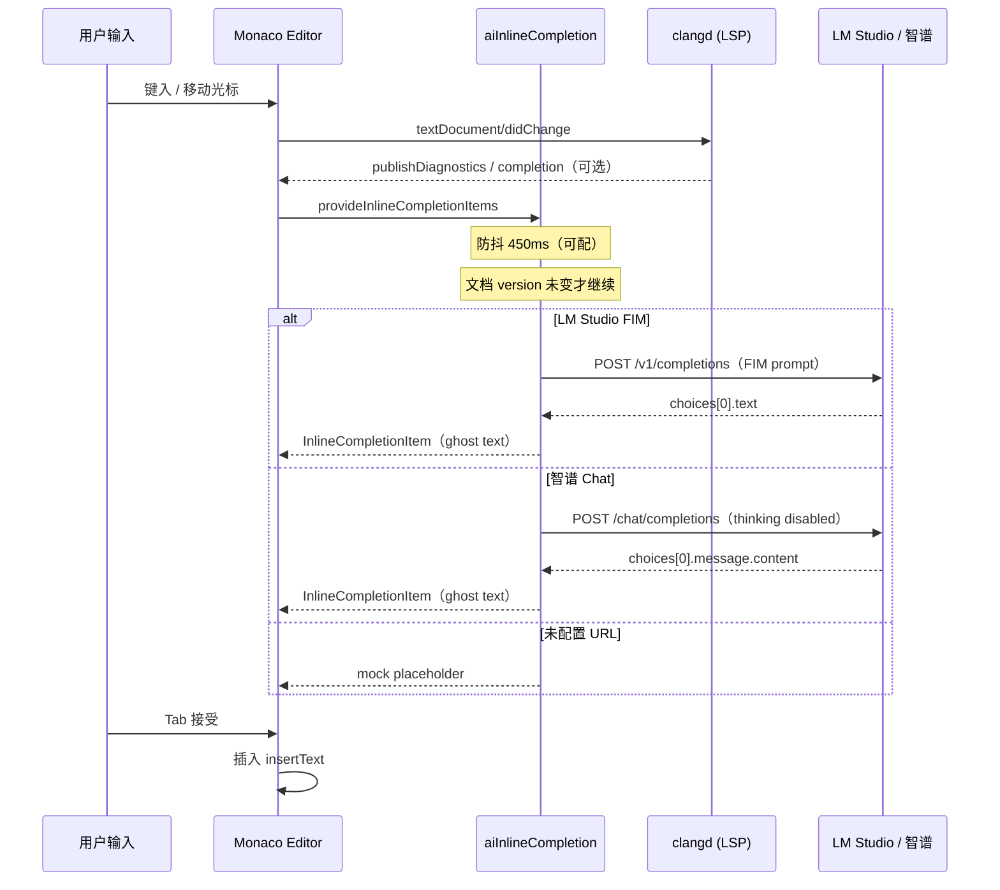

# Aily Code 内嵌编辑器 · 行内 AI 补全计划

## 1. 文档目标

本文档定义 **aily-coder 内嵌代码编辑器** 的行内补全（Inline Completion / Ghost Text）方案，技术栈固定为：

| 组件 | 选型 | 职责 |
|------|------|------|
| 推理运行时 | **LM Studio / 智谱 API** | 本机 FIM 或远程 Chat 补全 |
| 补全模型 | **DeepSeek Coder 1.3B / GLM-4.7-Flash** | 轻量 FIM 或远程代码生成 |
| 语言服务 | **clangd**（LSP） | C/C++ 语义补全、诊断、跳转 |

目标不是替代 Aily Blockly 主应用的 Agent / 对话 AI，而是在 **Monaco VS Code Workbench 编辑 surface** 上提供 Copilot 风格的灰字续写，并与 clangd 传统补全协同。

**关联实现：**

- 行内 AI：`src/features/aiInlineCompletion.ts`
- AI 请求适配：`src/features/aiInlineCompletionTransport.ts`
- LSP 客户端：`src/features/monacoStdioLspClient.ts`
- LSP 代理：`server/lspWsProxy.ts`
- 默认编辑器配置：`src/user/configuration.json`

**关联设计：**

- [aily-code-MVP实施清单.md](aily-code-MVP实施清单.md) — CORE-10 / BUILD-06（clangd 与 compile_commands）
- [aily-code最终目录与生命周期设计.md](aily-code最终目录与生命周期设计.md) — §6.5 语言服务索引

---

## 2. 能力边界

### 2.1 本方案提供

1. 用户停输入后，在光标处显示 **灰字 ghost text**，Tab 接受。
2. 基于当前文件光标前后文本的 **LM Studio FIM 或智谱 Chat 续写**。
3. 与 **clangd** 并存：LSP 负责符号补全、诊断、定义跳转；AI 负责多 token 行内续写。
4. 当 IntelliSense 列表已选中条目时，AI 输出须 **以所选前缀开头**（与 VS Code InlineCompletion 契约一致）。

### 2.2 本方案不提供

1. 项目级 Agent、工具调用、MCP、多文件重构 — 归属 **Aily Blockly 主应用**。
2. 云端大模型对话、长上下文代码审查。
3. 对 `.aci` 逻辑源文件的直接 AI 编织（仍经 generated / bridge 影子层与 clangd 索引）。

### 2.3 与主 AI 链的关系



---

## 3. 架构设计

### 3.1 三层分工

| 层 | 组件 | 协议 | 输出 |
|----|------|------|------|
| 表现层 | Monaco + `@codingame/monaco-vscode-api` | VS Code Extension Host API | ghost text、Suggest Widget |
| AI 补全层 | `aiInlineCompletion.ts` + `aiInlineCompletionTransport.ts` | LM Studio FIM / 智谱 Chat | 插入文本片段 |
| 语义层 | clangd + `lspWsProxy.ts` | LSP over WebSocket ⇄ stdio | 补全项、诊断、语义高亮 |

**原则：LSP 管「对不对」，AI 管「写下去」。**  
clangd 保证符号、类型、头文件路径正确；DeepSeek Coder 1.3B 在局部上下文中补全语句块、循环体、样板代码。

### 3.2 端到端拓扑（开发 / 嵌入）

```text
┌─────────────────────────────────────────────────────────────┐
│ 浏览器 / Electron iframe（aily-coder）                        │
│  ┌──────────────┐    ┌─────────────────────────────────┐  │
│  │ Monaco Editor│───▶│ aiInlineCompletion Provider     │  │
│  └──────┬───────┘    └──────────────┬──────────────────┘  │
│         │                           │ fetch POST           │
│         │                           ▼                      │
│         │              ├─ LM Studio /v1/completions
│         │              └─ 智谱 /chat/completions
│         │                           │                      │
│         ▼                           ▼                      │
│  ┌──────────────┐            ┌──────────────┐              │
│  │ monacoStdio  │◀──ws:3030─▶│ lspWsProxy   │──stdio──▶ clangd
│  │ LspClient    │            │ (Node)       │              │
│  └──────────────┘            └──────────────┘              │
└─────────────────────────────────────────────────────────────┘
         compile_commands.json ← .aily/bridge/（宿主构建链生成）
```

### 3.3 补全触发时序



---

## 4. LM Studio + DeepSeek Coder 1.3B（FIM 优化流程）

### 4.1 结论：FIM 是否更好？

**是，对 DeepSeek Coder 1.3B 行内补全，FIM + `/v1/completions` 显著优于 Chat Completions。**

| 维度 | Chat Completions（旧） | FIM + Completions（推荐） |
|------|------------------------|---------------------------|
| 与模型训练对齐 | instruct 对话格式，非补全主任务 | base 模型原生 Fill-in-the-Middle 预训练 |
| 输出污染 | 易带解释、markdown 围栏 | 直接续写 hole 区，垃圾 token 更少 |
| Prompt 体积 | 自然语言 + before/after 分隔符较长 | 结构化 metadata + FIM 块，更省 token |
| 延迟 | 同硬件下通常更慢 | `max_tokens: 64` + 短 prompt，P95 更低 |
| 截断控制 | 仅靠 prompt 约束 | prompt + `stop` 双保险 |
| 后缀感知 | 有 after 文本 | FIM suffix 显式参与 infilling，中间补全更准 |

**前提条件（缺一不可）：**

1. 使用 **`deepseek-coder-1.3b-base`**，不要用 `instruct` 变体（instruct 会忽略 FIM token）。
2. FIM 分隔符必须是 DeepSeek **原生特殊 token** `<｜fim▁begin｜>` / `<｜fim▁hole｜>` / `<｜fim▁end｜>`，文档中的 `<FIM_BEGIN>` 等为逻辑占位，见 §4.6。
3. LM Studio **Server 侧**配置 `context_length: 4096`、`gpu_offload: max`；**请求侧**传 `temperature` / `top_p` / `max_tokens` / `stop`。

### 4.2 LM Studio 参数（定稿）

#### Server / 模型加载（LM Studio UI）

| 参数 | 值 | 说明 |
|------|-----|------|
| context_length | **4096** | 覆盖 prefix + suffix + metadata |
| gpu_offload | **max** | 1.3B 尽量全量 offload，降低首 token 延迟 |
| top_k | **32** | 采样收窄，减少胡编（UI 侧） |
| repeat_penalty | **1.05** | 抑制重复 token（UI 侧） |

#### 单次补全请求（`POST /v1/completions`，由 `aiInlineCompletion.ts` 发送）

| 参数 | 值 | 说明 |
|------|-----|------|
| temperature | **0.15** | 低随机，贴近确定性补全 |
| top_p | **0.9** | 核采样 |
| max_tokens | **64** | 行内补全只需短片段 |
| stop | **`["\n\n", "```"]`** | 遇空行或 markdown _fence 立即停止 |

> `top_k`、`repeat_penalty` 由 LM Studio 本地 Server 全局/模型加载页设置；OpenAI 兼容 API 未必透传，以 UI 为准。

### 4.3 LM Studio 部署步骤

1. 安装 [LM Studio](https://lmstudio.ai/)。
2. 下载 **`deepseek-coder-1.3b-base`**（Q4_K_M 等量化即可）。
3. 加载模型 → **Local Server** → Start Server（默认 `http://127.0.0.1:1234`）。
4. 在模型加载页设置：`context_length=4096`、`gpu_offload=max`、`top_k=32`、`repeat_penalty=1.05`。
5. `curl http://127.0.0.1:1234/v1/models` 确认 model id 与 `.env` 一致。

### 4.4 aily-coder 环境变量

```bash
VITE_AI_INLINE_COMPLETION_URL=http://127.0.0.1:1234/v1
VITE_AI_INLINE_COMPLETION_KEY=
VITE_AI_INLINE_COMPLETION_MODEL=deepseek-coder-1.3b-base
VITE_AI_INLINE_PROVIDER=lmstudio-fim

# 可选：与 LM Studio 请求参数对齐
VITE_AI_INLINE_TEMPERATURE=0.15
VITE_AI_INLINE_TOP_P=0.9
VITE_AI_INLINE_MAX_TOKENS=64
VITE_AI_INLINE_DEBOUNCE_MS=450
VITE_AI_INLINE_MAX_BEFORE_CHARS=3500
VITE_AI_INLINE_MAX_AFTER_CHARS=1500
```

`VITE_AI_INLINE_PROVIDER=auto` 可按 URL 自动选择；旧的 `VITE_AI_INLINE_MODE=fim` 仍等价于 `lmstudio-fim`。

**URL 参数：** `?aiInlineUrl=...&aiInlineProvider=lmstudio-fim`

### 4.5 Prompt 模板（FIM 定稿）

#### 系统规则（固定）

```text
You are a professional C++ inline completion engine.

Rules:
- Complete code only
- No explanation
- No markdown
- Follow current style
- Prefer concise completion
- Stop immediately after completion
```

#### 输入格式（关键）

```text
Visible symbols:
{来自 clangd documentSymbol，逗号分隔；无 LSP 时为 (none)}

File path:
{document.uri.fsPath}

Language: cpp

<｜fim▁begin｜>
{prefix — 光标前文本，尾部截断至 MAX_BEFORE}
<｜fim▁hole｜>
{suffix — 光标后文本，头部截断至 MAX_AFTER}
<｜fim▁end｜>
```

**语义：** 模型在 `fim_hole` 位置生成应插入光标的代码，同时看见 prefix 与 suffix，适合「中间补全」而不仅是尾部续写。

**Visible symbols 来源：** 调用 `vscode.executeDocumentSymbolProvider`（clangd 索引就绪后自动填充当前文件函数/类/变量名），给 1.3B 小模型额外语义锚点，成本低、收益明显。

### 4.6 逻辑占位符 vs 原生 token

文档与方案讨论中可写逻辑名：

```text
<FIM_BEGIN> … <FIM_HOLE> … <FIM_END>
```

**实现必须映射为 DeepSeek Coder base 原生 token：**

| 逻辑 | 原生 token |
|------|------------|
| FIM_BEGIN | `<\|redacted_fim_begin\|>` |
| FIM_HOLE | `<\|redacted_fim_hole\|>` |
| FIM_END | `<\|redacted_fim_end\|>` |

可通过 `VITE_AI_INLINE_FIM_BEGIN` 等环境变量覆盖（换模型时）。

### 4.7 与 LSP Suggest 协同

当 IntelliSense 列表有选中项时，在 FIM prompt 末尾追加前缀约束；返回后 `mergeInsertExtendingSelected` 保证 ghost text 以 LSP 选中项开头（VS Code InlineCompletion 契约）。

### 4.8 后处理（双保险）

即使模型偶发违规，客户端仍会：

1. `sanitizeInlineCompletionOutput` 去掉 leading markdown fence；
2. 截断首个 `\n\n`；
3. 与 API `stop` 序列形成双保险。

---

## 4A. 智谱 Chat 适配

智谱适配走 `POST /chat/completions` + before/after 自然语言 prompt，请求会固定传入 `thinking.type=disabled`、`do_sample=false`和 `stream=false`，避免行内补全被思考 token 和随机采样拖慢。

```bash
VITE_AI_INLINE_PROVIDER=zhipu-chat
VITE_AI_INLINE_COMPLETION_URL=https://open.bigmodel.cn/api/paas/v4
VITE_AI_INLINE_COMPLETION_MODEL=glm-4.7-flash
VITE_AI_INLINE_COMPLETION_KEY=仅供前端联调的密钥
```

生产版不应将密钥放在 `VITE_` 变量中，后续应将相同 Chat 协议迁到独立服务器。两个 provider 都使用可中止超时、按 origin 的最小请求间隔，遇到 429 时优先遵循 `Retry-After`，否则进入默认 30s 冷却。

---

## 5. clangd LSP 集成

### 5.1 职责

clangd 为内嵌编辑器提供 **非 AI** 的语言智能：

1. `textDocument/completion` — 符号、成员、头文件 snippet
2. `textDocument/publishDiagnostics` — 编译期诊断
3. `textDocument/definition` / `references` — 跳转
4. Semantic Tokens — 语义高亮（`editor.semanticHighlighting.enabled: true`）

行内 AI **不替代** 上述能力；二者在 UI 层由 VS Code 合并调度。

### 5.2 启动 LSP 代理

```bash
# 终端 1：aily-coder 开发服务
npm start

# 终端 2：WebSocket ⇄ clangd stdio
npm run lsp-proxy -- --compile-commands-dir=/path/to/project/.aily/bridge
```

环境变量（可选）：

| 变量 | 默认 | 说明 |
|------|------|------|
| `LSP_WS_PORT` | `3030` | WebSocket 监听端口 |
| `LSP_WS_HOST` | `0.0.0.0` | 绑定地址 |
| `LSP_SERVER_COMMAND` | `clangd` | 可执行文件路径 |
| `LSP_SERVER_LABEL` | `clangd` | 日志标签 |

### 5.3 前端连接参数

iframe / 开发 URL 查询参数：

| 参数 | 默认 | 说明 |
|------|------|------|
| `lspWs` | — | 完整 WebSocket URL（优先） |
| `lspWsPort` | `3030` | `ws://{host}:{port}` |
| `lspLanguages` | `cpp,c,cuda-cpp,objective-cpp` | 文档选择器 |
| `clangdWs` / `clangdWsPort` | — | 兼容旧参数名 |

示例：

```text
http://127.0.0.1:5174/?folder=/path/to/project&lspWsPort=3030
```

### 5.4 compile_commands 依赖

clangd 索引质量直接决定 LSP 补全与诊断是否可用。按 [aily-code最终目录与生命周期设计.md](aily-code最终目录与生命周期设计.md) §6.5：

1. 宿主构建链生成 `.aily/bridge/compile_commands.json`
2. `lsp-proxy` 通过 `--compile-commands-dir` 指向该目录
3. SDK 头文件、`include/`、`src/`、`components/` 纳入索引
4. 诊断与跳转映射回用户可见源文件（含 `.aci` → 影子 cpp 的 source map，MVP 进行中）

**无 compile_commands 时：** clangd 仍可启动，但补全/诊断质量显著下降；行内 AI 仍可工作（仅依赖缓冲区文本）。

### 5.5 与行内 AI 的协同规则

| 场景 | clangd | 行内 AI | 用户感知 |
|------|--------|---------|----------|
| 输入 `Serial.` | 弹出成员列表 | 可能显示续写 `println(...)` | 先选 LSP 项或 Tab 接受 AI |
| Suggest 已选中 | `selectedCompletionInfo` 传入 AI | 输出必须以前缀开头 | 灰字接在选中项之后 |
| 语法错误行 | 红色波浪线 | AI 仍可能给续写 | 以诊断为准，AI 仅辅助 |
| 大段粘贴后 | 重新索引 | 防抖 + version 校验丢弃过期请求 | 无 stale ghost text |

编辑器默认配置（`configuration.json`）已启用：

```json
"editor.inlineSuggest.enabled": true,
"editor.wordBasedSuggestions": "off"
```

避免 word-based 与 AI / LSP 三路补全争抢。

---

## 6. 现有实现状态

| 项 | 状态 | 说明 |
|----|------|------|
| InlineCompletion Provider 注册 | ✅ 已实现 | `registerInlineCompletionItemProvider('*')` |
| LM Studio FIM 适配 | ✅ 已实现 | `fetchLmStudioFimInlineCompletion` + DeepSeek FIM token |
| 智谱 Chat 适配 | ✅ 已实现 | `fetchZhipuChatInlineCompletion` + 禁用 Thinking |
| FIM Prompt + Visible symbols | ✅ 已实现 | `buildFimPrompt` + `documentSymbolProvider` |
| 推理参数（temp/top_p/max_tokens/stop） | ✅ 已实现 | 请求体 + `.env` 可配 |
| 输出 sanitize | ✅ 已实现 | 去 markdown / 双换行截断 |
| provider 自动识别 | ✅ 已实现 | `auto` / `lmstudio-fim` / `zhipu-chat` |
| 超时与 429 冷却 | ✅ 已实现 | AbortController + origin 级限流 |
| 双防抖（扩展内 + 宿主） | ✅ 已实现 | 450ms / 900ms 可配 |
| 文档 version 防 stale | ✅ 已实现 | 请求前后校验 |
| In-flight 请求 abort | ✅ 已实现 | 新请求前 abort 上一轮 |
| LSP Suggest 前缀合并 | ✅ 已实现 | `selectedCompletionInfo` |
| 未配置 API 时 mock | ✅ 已实现 | `[AI inline placeholder]` |
| clangd WebSocket 代理 | ✅ 已实现 | `server/lspWsProxy.ts` |
| Monaco LSP 客户端 | ✅ 已实现 | `monacoStdioLspClient.ts` |
| Electron 嵌入默认启 LM Studio | ⬜ 待做 | 宿主需文档化 / 可选打包 LM Studio |
| 设置页 UI 配置 inline AI | ⬜ 待做 | 当前仅 `.env` / URL 参数 |
| clangd 符号 → Visible symbols 质量验证 | ⬜ 待测 | 依赖 compile_commands 就绪 |
| `.aci` 源映射下行内补全 | ⬜ 依赖 MVP | CORE-08/09/10 |

---

## 7. 实施任务清单

按阶段推进，可与 [aily-code-MVP实施清单.md](aily-code-MVP实施清单.md) 的 M2 语言服务里程碑对齐。

### 7.1 M1 — 本地开发闭环（1 ~ 2 天）

| ID | 任务 | 验收标准 |
|----|------|----------|
| IA-01 | LM Studio 加载 DeepSeek Coder 1.3B 并开启 Local Server | `curl http://127.0.0.1:1234/v1/models` 返回模型列表 |
| IA-02 | 配置 `.env` 中 `VITE_AI_INLINE_*` | `npm start` 后编辑 `main.cpp` 出现 ghost text |
| IA-03 | 并行启动 `npm run lsp-proxy` + clangd | WS 3030 连接成功，无 console 报错 |
| IA-04 | 指向真实工程 `compile_commands.json` | `Serial` 等 SDK 符号有 LSP 补全 |
| IA-05 | 验证 Tab 接受 / Esc 取消 | 与 VS Code 行为一致 |

### 7.2 M2 — 嵌入宿主联调（2 ~ 3 天）

| ID | 任务 | 验收标准 |
|----|------|----------|
| IA-06 | Aily Blockly `code-editor-pro` iframe 加载 aily-coder | 嵌入模式下 inline + LSP 均可用 |
| IA-07 | 宿主构建完成后刷新 bridge / compile_commands | Rebuild 后 clangd 诊断更新 |
| IA-08 | Electron 下 LM Studio  localhost 可达 | 无 CORS 问题（fetch 127.0.0.1） |
| IA-09 | 记录联调手册（本文 §8） | 新同学 30 分钟内跑通 |

### 7.3 M3 — 产品化（可选，3 ~ 5 天）

| ID | 任务 | 验收标准 |
|----|------|----------|
| IA-10 | 宿主设置页：Inline AI 开关 + LM Studio URL | 写入配置，iframe 可读 |
| IA-11 | 状态栏指示：LSP 已连接 / AI 可用 | 断连时有明确提示 |
| IA-12 | 延迟与错误可观测 | Output 通道或 debug 日志 |
| IA-13 | FIM vs Chat A/B 对比 | 同硬件 FIM P95 延迟与接受率优于 Chat |
| IA-14 | 多 profile compile_commands 切换 | 切板卡后 LSP 索引正确 |

---

## 8. 本地联调 Runbook

### 8.1 前置条件

- Node.js 22+
- `clangd` 在 PATH（Xcode CLT / LLVM 发行版）
- LM Studio 已安装并加载 DeepSeek Coder 1.3B
- 已打开含 `project.aci` 的 Aily Code 工程，且 `.aily/bridge/compile_commands.json` 存在（或先用模板工程）

### 8.2 四终端启动顺序

```bash
# T1 — LM Studio：UI 内 Start Server（1234）

# T2 — LSP 代理
cd child/aily-coder
npm run lsp-proxy -- --compile-commands-dir=/absolute/path/to/project/.aily/bridge

# T3 — aily-coder（确保 .env 已配 LM Studio）
npm start

# T4 —（可选）Aily Blockly 宿主
cd ../..
npm start   # 或 Electron 开发命令
```

### 8.3 冒烟测试用例

| # | 操作 | 期望 |
|---|------|------|
| 1 | 在 `main.cpp` 的 `setup()` 内输入 `for (int i = 0; ` | 数百 ms 内出现灰字续写 |
| 2 | 输入 `Serial.` | clangd 弹出成员列表 |
| 3 | 在列表选中 `begin` 后继续停输入 | AI 灰字以 `begin` 为前缀延伸 |
| 4 | 故意写错类型 | clangd 红色诊断；AI 不掩盖错误 |
| 5 | 停止 LM Studio | ghost text 消失或停止更新；编辑器仍可用 |
| 6 | 停止 lsp-proxy | 无 LSP 补全；AI 仍可用 |

### 8.4 常见问题

| 现象 | 排查 |
|------|------|
| 始终显示 `[AI inline placeholder]` | 检查 `VITE_AI_INLINE_COMPLETION_URL` 是否为空 |
| HTTP 404 / model not found | `VITE_AI_INLINE_COMPLETION_MODEL` 与 LM Studio 加载名不一致 |
| WebSocket failed | `lsp-proxy` 未启动或端口被占用 |
| clangd 无补全 | `compile_commands.json` 路径错误或 stale |
| ghost text 闪退 | 正常：防抖 epoch / version 变更会丢弃；可增大 `VITE_AI_INLINE_DEBOUNCE_MS` |
| CORS 错误 | LM Studio 需允许本地来源；或经 Electron 主进程代理（待 IA-08） |

---

## 9. 验收标准（Definition of Done）

### 9.1 功能

1. 在 `src/main.cpp` 编辑时，配置 LM Studio 后 **80% 以上** 停输入场景能在 1s 内出现 ghost text（M1 开发机基准）。
2. clangd 连接正常时，SDK 符号补全可用，且与 ghost text 不互斥。
3. Tab 接受插入内容无多余 markdown 包裹。
4. 未启动 LM Studio 时，编辑器不崩溃；可选关闭 inline suggest。

### 9.2 非功能

1. 连续快速输入不产生 stale 补全（依赖 version + epoch）。
2. 单次补全 prompt 上下文受 `MAX_BEFORE/AFTER` 限制，避免 LM Studio OOM。
3. 不在前端 bundle 硬编码 API Key；本地 Key 留空。

### 9.3 文档

1. 本文档 + README「行间 AI 补全」章节保持一致。
2. Runbook 可被测试同学独立执行。

---

## 10. 风险与限制

| 风险 | 影响 | 缓解 |
|------|------|------|
| 1.3B 模型能力上限 | 复杂模板 / 宏补全质量差 | 依赖 clangd；AI 只做短续写 |
| 误用 instruct 模型 | FIM token 被忽略，输出废话 | 文档与 `.env` 强制 `base` |
| FIM token 字符错误 | 补全完全失效 | 使用原生 `<\|redacted_fim_* \|>`，勿手写 ASCII 占位 |
| 本地 GPU 差异 | 延迟不稳定 | LM Studio gpu_offload=max；可调 debounce |
| iframe 跨域 fetch localhost | 部分浏览器策略 | Electron 嵌入为主 |
| compile_commands 滞后 | Visible symbols / 诊断不准 | 构建完成事件刷新 bridge |
| 用户未装 LM Studio | 无 AI 补全 | mock 占位 + 设置引导 |

---

## 11. 后续演进（非 MVP）

1. **跨文件符号摘要**：除当前文件 `Visible symbols` 外，从 clangd workspace symbol 拉取 `#include` 关联头文件声明。
2. **宿主设置页**：Inline AI 开关、LM Studio URL、FIM/Chat 切换。
3. **延迟指标**：记录 TTFT / 接受率，自动调 debounce。
4. **LSP + AI 排序融合**：snippet 高置信时抑制 ghost text。
5. **compile_commands 热更新**：监听 `.aily/bridge` 变更自动重启 clangd。

---

## 12. 配置速查表

| 用途 | 键 / 参数 | 示例 |
|------|-----------|------|
| LM Studio API | `VITE_AI_INLINE_COMPLETION_URL` | `http://127.0.0.1:1234/v1` |
| 智谱 API | `VITE_AI_INLINE_COMPLETION_URL` | `https://open.bigmodel.cn/api/paas/v4` |
| 模型（base） | `VITE_AI_INLINE_COMPLETION_MODEL` | `deepseek-coder-1.3b-base` |
| provider | `VITE_AI_INLINE_PROVIDER` | `auto` |
| temperature | `VITE_AI_INLINE_TEMPERATURE` | `0.15` |
| top_p | `VITE_AI_INLINE_TOP_P` | `0.9` |
| max_tokens | `VITE_AI_INLINE_MAX_TOKENS` | `64` |
| stop（代码内定） | — | `\n\n`, ` ``` ` |
| LM Studio UI | top_k / repeat_penalty / gpu_offload | `32` / `1.05` / `max` |
| API Key | `VITE_AI_INLINE_COMPLETION_KEY` | 留空 |
| 停输入防抖 | `VITE_AI_INLINE_DEBOUNCE_MS` | `450` |
| 请求超时 | `VITE_AI_INLINE_TIMEOUT_MS` | `12000` |
| 最小请求间隔 | `VITE_AI_INLINE_MIN_REQUEST_INTERVAL_MS` | `1500` |
| 429 默认冷却 | `VITE_AI_INLINE_RATE_LIMIT_COOLDOWN_MS` | `30000` |
| FIM prefix 上限 | `VITE_AI_INLINE_MAX_BEFORE_CHARS` | `3500` |
| FIM suffix 上限 | `VITE_AI_INLINE_MAX_AFTER_CHARS` | `1500` |
| 调试 URL | `?aiInlineUrl=` / `?aiInlineProvider=` | `zhipu-chat` |
| LSP WebSocket | `?lspWsPort=` | `3030` |
| clangd 索引 | `npm run lsp-proxy -- --compile-commands-dir=` | `.aily/bridge` |

---

## 13. 修订记录

| 日期 | 版本 | 说明 |
|------|------|------|
| 2026-05-29 | 0.1 | 初稿：LM Studio + DeepSeek Coder 1.3B + clangd 行内补全计划 |
| 2026-05-29 | 0.2 | 定稿 FIM 流程：LM Studio 参数、Prompt 模板、实现切换 `/completions` |
